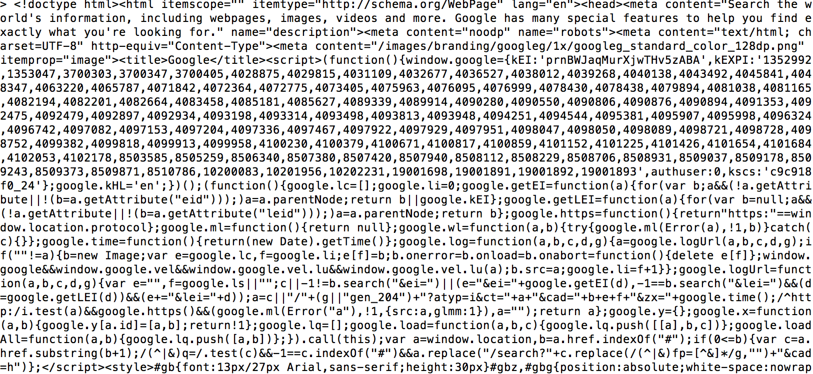
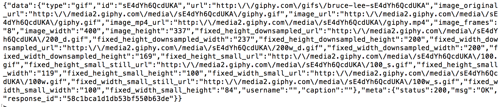

# Making External API calls with Node

## Exercise Objectives
* Practice with Node.js commands in terminal
* Make external API calls with Node.js and request
* Understand what Node.js is and how Express.js interacts with it

## Instructions
- For this exercise you will need to have Node.js installed and `npm install request` into your root directory that you will be working in. In this case, it'll be the `requests` folder. 

## Requesting Google Homepage

  - For the first exercise, we'll be making a request to the Google homepage in Node. What this will return is the HTML elements that render when we visit the google homepage, except now it'll be shown in our terminal. 

We should have returned something like the image below. This is just all the HTML elements that return when we access http://www.google.com.

## Requesting Random Gifs
Now that we requested the google homepage, let's step up our API request game a bit and get a random GIF image! 

- Read through the Giphy API [here](https://github.com/Giphy/GiphyAPI).
- Get a random Giphy without a parameter.
- Get a random Giphy using `wall-to-wall` as a parameter;
- Go to http://jsonprettyprint.com/ and paste the body response to convert into pretty print JSON. 
- Paste the link in the two requests that you get in `image_original_url`

You can view these gifs if you reformat the JSON into proper URI.

## **BONUS**
Read through the http://www.omdbapi.com/ docs and make 3 movie requests of your choice. Make a markdown file labeled `movies` and copy and paste 3 screenshots of those responses into that folder.

## **SUPER BONUS**
Find an API that requires a key to access and make a request to that API. 
https://github.com/toddmotto/public-apis

Copy and paste a screenshot of the response and put it in the folder `i_am_a_stud`.

## Submitting Your Work

  When you're ready, create an issue on the class repo with
  a title in the format "First and Last Name -- Week XX Day XX".
  The issue body should have:

  *   A link to your forked repo (ie. to your `homework` folder)
  *   A 'comfort' score on how you feel about your answers, from 1 (very
      uncomfortable) to 5 (very comfortable)
  *   A 'completeness' score, from 1 (didn't do it) to 5 (finished all of it)    
  *   A 'win'
  *   A 'struggle'
  *   A 'comment'
